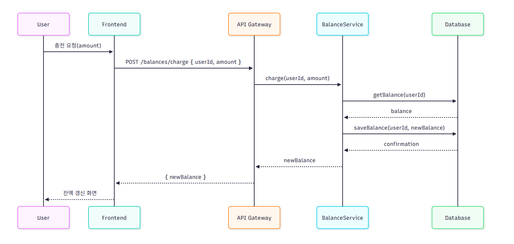
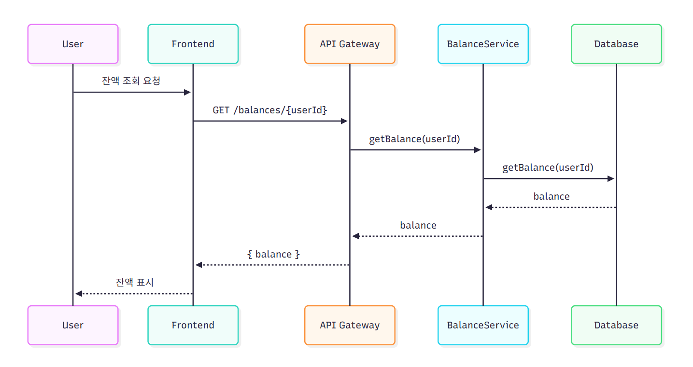
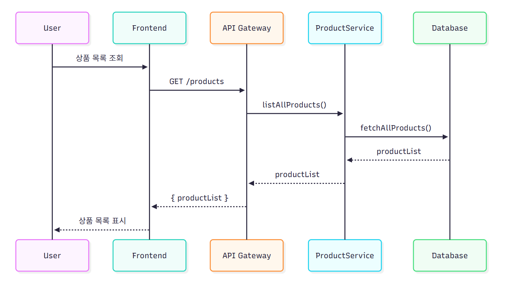
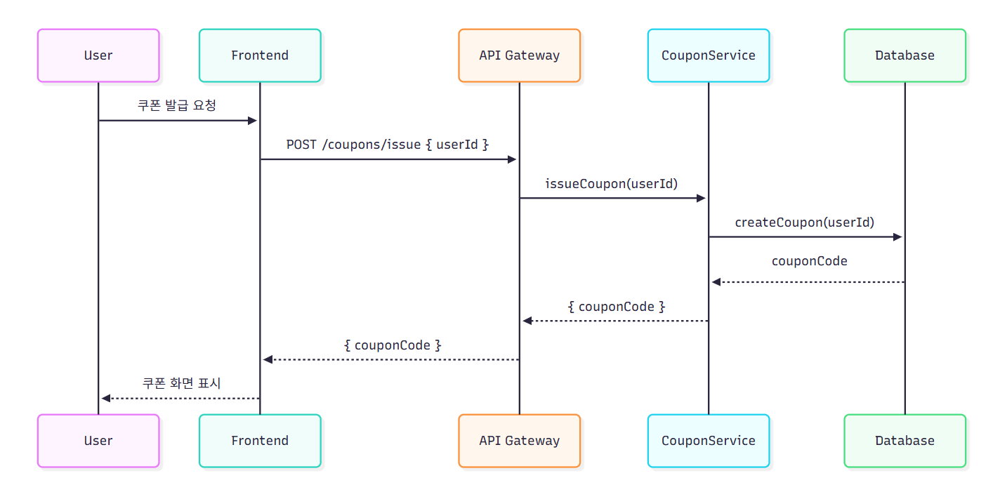
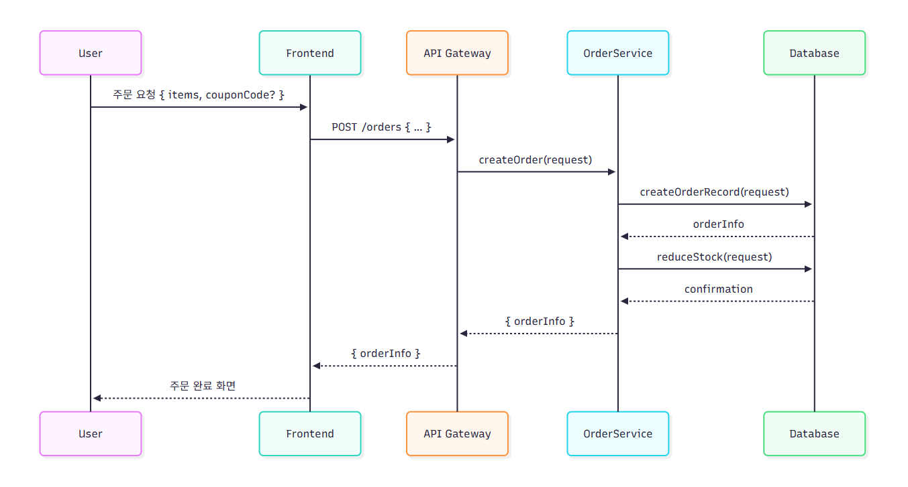
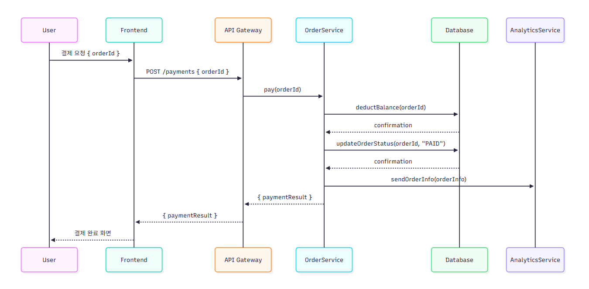
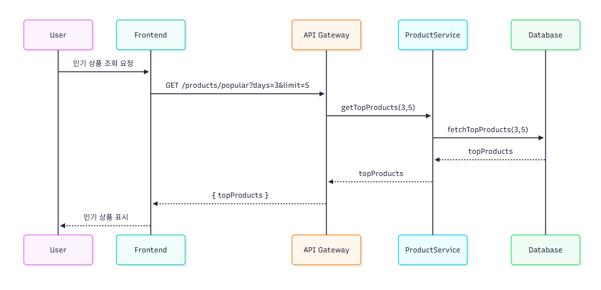

# 1. 시퀀스 다이어그램

> 시스템 내에서 객체(또는 서비스)들이 어떻게 상호 작용하는지를 시간 순서대로 표현

#### 1. 잔액 충전


#### 2. 잔액 조회


#### 3. 상품 조회


#### 4. 선착순 쿠폰 발급 & 검증


#### 5. 주문 생성


#### 6. 주문 결재


#### 7. 인기 판매 상품 조회


<br>

---
<br>

# 2. 시퀀스 다이어그램 mermaid 코드

#### 1. 잔액 충전

```
sequenceDiagram
    participant U as User
    participant FE as Frontend
    participant API as API Gateway
    participant BS as BalanceService
    participant DB as Database

    U->>FE: 충전 요청(amount)
    FE->>API: POST /balances/charge { userId, amount }
    API->>BS: charge(userId, amount)
    BS->>DB: getBalance(userId)
    DB-->>BS: balance
    BS->>DB: saveBalance(userId, newBalance)
    DB-->>BS: confirmation
    BS-->>API: newBalance
    API-->>FE: { newBalance }
    FE-->>U: 잔액 갱신 화면
```

#### 2. 잔액 조회

```
sequenceDiagram
    participant U as User
    participant FE as Frontend
    participant API as API Gateway
    participant BS as BalanceService
    participant DB as Database

    U->>FE: 잔액 조회 요청
    FE->>API: GET /balances/{userId}
    API->>BS: getBalance(userId)
    BS->>DB: getBalance(userId)
    DB-->>BS: balance
    BS-->>API: balance
    API-->>FE: { balance }
    FE-->>U: 잔액 표시
```

#### 3. 상품 조회

```
sequenceDiagram
    participant U as User
    participant FE as Frontend
    participant API as API Gateway
    participant PS as ProductService
    participant DB as Database

    U->>FE: 상품 목록 조회
    FE->>API: GET /products
    API->>PS: listAllProducts()
    PS->>DB: fetchAllProducts()
    DB-->>PS: productList
    PS-->>API: productList
    API-->>FE: { productList }
    FE-->>U: 상품 목록 표시
```

#### 4. 선착순 쿠폰 발급 & 검증

```
sequenceDiagram
    participant U as User
    participant FE as Frontend
    participant API as API Gateway
    participant CS as CouponService
    participant DB as Database

    U->>FE: 쿠폰 발급 요청
    FE->>API: POST /coupons/issue { userId }
    API->>CS: issueCoupon(userId)
    CS->>DB: createCoupon(userId)
    DB-->>CS: couponCode
    CS-->>API: { couponCode }
    API-->>FE: { couponCode }
    FE-->>U: 쿠폰 화면 표시
```

#### 5. 주문 생성

```
sequenceDiagram
    participant U as User
    participant FE as Frontend
    participant API as API Gateway
    participant OS as OrderService
    participant DB as Database

    U->>FE: 주문 요청 { items, couponCode? }
    FE->>API: POST /orders { … }
    API->>OS: createOrder(request)
    OS->>DB: createOrderRecord(request)
    DB-->>OS: orderInfo
    OS->>DB: reduceStock(request)
    DB-->>OS: confirmation
    OS-->>API: { orderInfo }
    API-->>FE: { orderInfo }
    FE-->>U: 주문 완료 화면
```

#### 6. 주문 결재

```
sequenceDiagram
    participant U as User
    participant FE as Frontend
    participant API as API Gateway
    participant OS as OrderService
    participant DB as Database
    participant AN as AnalyticsService

    U->>FE: 결제 요청 { orderId }
    FE->>API: POST /payments { orderId }
    API->>OS: pay(orderId)
    OS->>DB: deductBalance(orderId)
    DB-->>OS: confirmation
    OS->>DB: updateOrderStatus(orderId, "PAID")
    DB-->>OS: confirmation
    OS->>AN: sendOrderInfo(orderInfo)
    OS-->>API: { paymentResult }
    API-->>FE: { paymentResult }
    FE-->>U: 결제 완료 화면
```

#### 7. 인기 판매 상품 조회

```
sequenceDiagram
    participant U as User
    participant FE as Frontend
    participant API as API Gateway
    participant PS as ProductService
    participant DB as Database

    U->>FE: 인기 상품 조회 요청
    FE->>API: GET /products/popular?days=3&limit=5
    API->>PS: getTopProducts(3,5)
    PS->>DB: fetchTopProducts(3,5)
    DB-->>PS: topProducts
    PS-->>API: topProducts
    API-->>FE: { topProducts }
    FE-->>U: 인기 상품 표시
```
