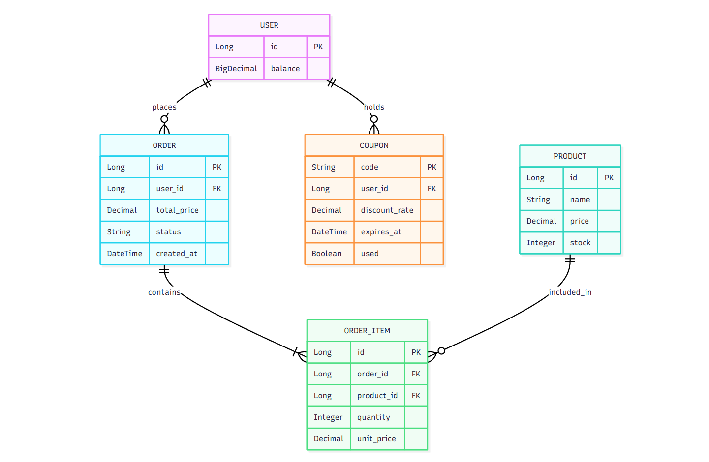
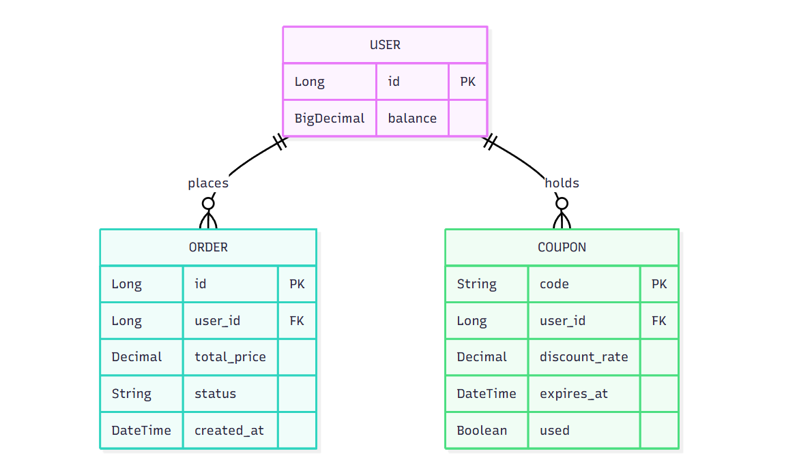
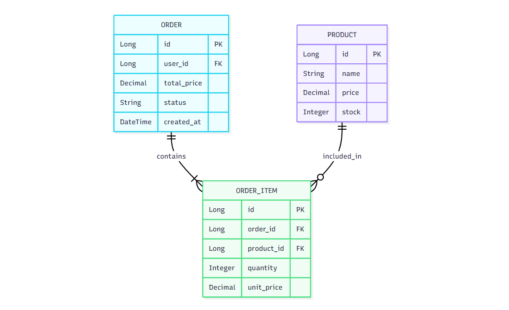
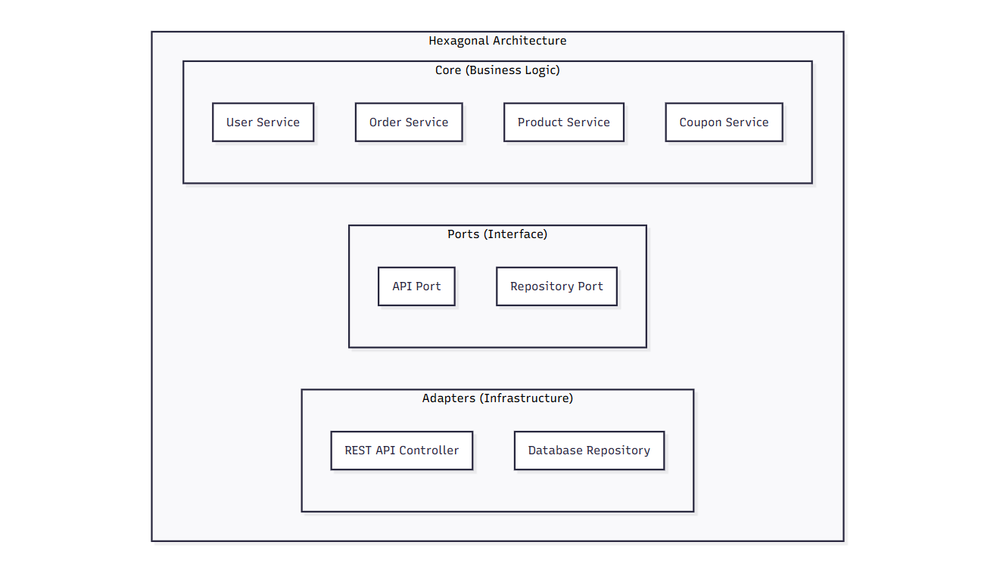
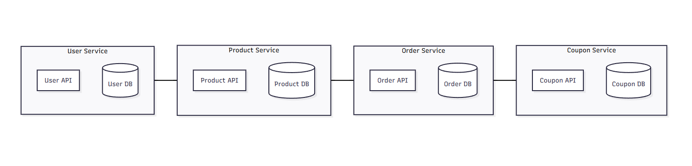

# ERD

> ERD(Entity Relationship Diagram)는 데이터베이스의 테이블 간 관계를 표현하는 다이어그램

<br>

---
<br>

## 1. 구성 정보

> 시스템의 데이터 구조를 정의하는 첫 단계로 핵심 엔티티와 관계를 설정

#### 엔티티&속성

| 엔티티  | 속성                                     |
|------|----------------------------------------|
| 사용자  | id(PK), 잔액                             |
| 상품   | id(PK), 이름, 가격, 재고                     |
| 쿠폰   | 코드(PK), 사용자_id(FK), 할인율, 만료일, 사용여부     | 
| 주문   | id(PK), 사용자_id(FK), 총금액, 상태, 생성일       |
| 주문항목 | id(PK), 주문_id(FK), 상품_id(FK), 수량, 단가   |

| Entity    | Attributes                                                 |
|-----------|------------------------------------------------------------|
| User      | id(PK), balance                                            |
| Product   | id(PK), name, price, stock                                 |
| Coupon    | code(PK), user_id(FK), discount_rate, expires_at, used     |
| Order     | id(PK), user_id(FK), total_price, status, created_at       |
| OrderItem | id(PK), order_id(FK), product_id(FK), quantity, unit_price |


#### 관계

- User:Order`(1:N)` : 한 사용자가 여러 주문을 생성
- Order:OrderItem`(1:N)` : 한 주문에 여러 항목 포함
- Product:OrderItem`(1:N)` : 한 상품이 여러 주문 항목에 포함
- User:Coupon`(1:N)` : 한 사용자가 여러개의 쿠폰 소유(중복 불가능)


<br>

---
<br>

## 2. 설계

### 2.1. 다이어그램

#### 전체 구조


#### User - Order, Coupon


#### OrderItem - Order, Product


- places
  - 사용자가 주문을 생성하거나 제출한다는 의미
  - 사용자가 주문을 한다는 관계
- holds
  - 사용자가 쿠폰을 소유한다는 의미
  - 사용자가 쿠폰을 가지고 있다는 관계
- contains
  - 주문이 주문 항목을 포함한다는 의미
  - 하나의 주문이 여러 주문 항목(1개 이상)으로 구성되는 관계
- included_in
  - 상품이 주문 항목에 포함된다는 의미
  - 주문 항목이 특정 상품을 참조한다는 관계


### 2.2. Mermaid 코드

#### 전체 구조
```
erDiagram
    USER {
        Long id PK
        BigDecimal balance
    }
    PRODUCT {
        Long id PK
        String name
        Decimal price
        Integer stock
    }
    COUPON {
        String code PK
        Long user_id FK
        Decimal discount_rate
        DateTime expires_at
        Boolean used
    }
    "ORDER" {
        Long id PK
        Long user_id FK
        Decimal total_price
        String status
        DateTime created_at
    }
    ORDER_ITEM {
        Long id PK
        Long order_id FK
        Long product_id FK
        Integer quantity
        Decimal unit_price
    }
    USER ||--o{ "ORDER" : places
    "ORDER" ||--|{ ORDER_ITEM : contains
    PRODUCT ||--o{ ORDER_ITEM : included_in
    USER ||--o{ COUPON : holds
```

#### User - Order, Coupon
```
erDiagram
    USER ||--o{ "ORDER" : places
    USER ||--o{ COUPON : holds
    USER {
        Long id PK
        BigDecimal balance
    }
    "ORDER" {
        Long id PK
        Long user_id FK
        Decimal total_price
        String status
        DateTime created_at
    }
    COUPON {
        String code PK
        Long user_id FK
        Decimal discount_rate
        DateTime expires_at
        Boolean used
    }
```

#### OrderItem - Order, Product
```
erDiagram
    "ORDER" ||--|{ ORDER_ITEM : contains
    PRODUCT ||--o{ ORDER_ITEM : included_in
    "ORDER" {
        Long id PK
        Long user_id FK
        Decimal total_price
        String status
        DateTime created_at
    }
    ORDER_ITEM {
        Long id PK
        Long order_id FK
        Long product_id FK
        Integer quantity
        Decimal unit_price
    }
    PRODUCT {
        Long id PK
        String name
        Decimal price
        Integer stock
    }
```

<br>

---
<br>

## 3. Hexagonal Architecture

> 비즈니스 로직을 중심으로 외부 의존성을 포트와 어댑터로 분리하여 테스트 가능하고 유연한 아키텍처를 구성




<br>

---
<br>

## 4. Micro Service Architecture

> 각 도메인 별로 독립적인 서비스와 데이터베이스를 구성하여 확장성과 유지보수성을 높인 분산 아키텍처



