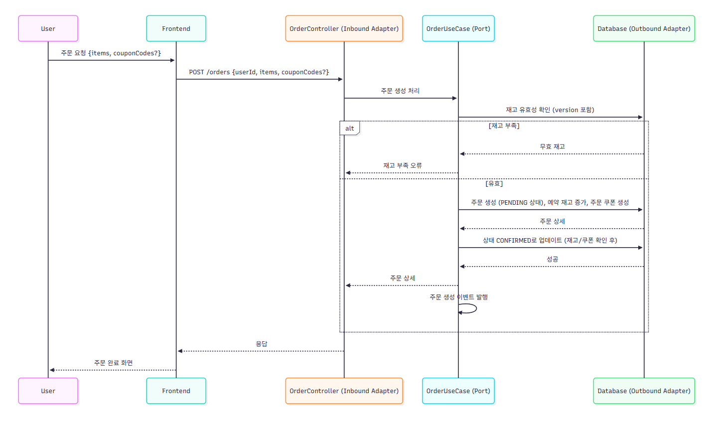

# 목차
#### 1. ERD
#### 2. 엔티티 상세 설명
#### 3. 시퀀스 다이어그램
#### 4. ERD Mermaid Code
#### 5. Diagram Mermaid Code

<br>

---

<br>

# 1. ERD


- 관계
  - USER:ORDERS (1:N) : places 
    - 한 사용자가 여러 주문을 생성
  - USER:COUPON (1:N) : holds 
    - 한 사용자가 여러 쿠폰 소유, 중복 발급 방지
  - COUPON_EVENT:COUPON (1:N) : issues 
    - 하나의 쿠폰 이벤트가 여러 쿠폰 발급, 총/남은 수량으로 선착순 제한 관리, 이벤트별 발급 제약 적용
  - ORDERS:ORDER_ITEM (1:N) : contains 
    - 한 주문에 여러 항목 포함
  - PRODUCT:ORDER_ITEM (1:N) : included_in 
    - 한 상품이 여러 주문 항목에 포함
  - ORDERS:ORDER_COUPON (1:N) : applies 
    - 하나의 주문에 여러 쿠폰 가능, 할인 금액 추적 및 복구 용이

<br>

# 2. 엔티티 상세 설명

### USER (사용자)
| 속성      | 타입         | 설명                  |
|---------|------------|---------------------|
| id      | Long (PK)  | 사용자 고유 식별자          |
| balance | BigDecimal | 사용자 계좌 잔액 (포인트/충전금) |

### PRODUCT (상품)
| 속성             | 타입         | 설명                  |
|----------------|------------|---------------------|
| id             | Long (PK)  | 상품 고유 식별자           |
| name           | String     | 상품명                 |
| price          | BigDecimal | 상품 가격               |
| stock          | Integer    | 실제 재고 수량            |
| reserved_stock | Integer    | 임시 예약된 재고 (주문 대기 중) |
| updated_at     | DateTime   | 최종 수정 시간            |
| version        | Long       | 버전 관리               |

### COUPON_EVENT (쿠폰 이벤트)
| 속성                 | 타입         | 설명              |
|--------------------|------------|-----------------|
| id                 | Long (PK)  | 쿠폰 이벤트 고유 식별자   |
| name               | String     | 이벤트명            |
| discount_rate      | BigDecimal | 할인율 (0.1 = 10%) |
| total_quantity     | Integer    | 총 발급 가능 수량      |
| remaining_quantity | Integer    | 남은 발급 가능 수량     |
| expires_at         | DateTime   | 쿠폰 만료 일시        |

### COUPON (쿠폰)
| 속성              | 타입          | 설명             |
|-----------------|-------------|----------------|
| code            | String (PK) | 쿠폰 고유 코드       |
| user_id         | Long (FK)   | 쿠폰을 소유한 사용자 ID |
| coupon_event_id | Long (FK)   | 쿠폰이 속한 이벤트 ID  |
| issued_at       | DateTime    | 발급 일시          |
| used            | Boolean     | 사용 여부          |

### ORDERS (주문)
| 속성          | 타입         | 설명                |
|-------------|------------|-------------------|
| id          | Long (PK)  | 주문 고유 식별자         |
| user_id     | Long (FK)  | 주문한 사용자 ID        |
| total_price | BigDecimal | 총 주문 금액 (할인 적용 후) |
| status      | Enum       | 주문 상태             |
| created_at  | DateTime   | 주문 생성 일시          |

### ORDER_ITEM (주문 항목)
| 속성         | 타입         | 설명           |
|------------|------------|--------------|
| id         | Long (PK)  | 주문 항목 고유 식별자 |
| order_id   | Long (FK)  | 속한 주문 ID     |
| product_id | Long (FK)  | 주문한 상품 ID    |
| quantity   | Integer    | 주문 수량        |
| unit_price | BigDecimal | 주문 당시 상품 단가  |

### ORDER_COUPON (주문 쿠폰)
| 속성              | 타입          | 설명            |
|-----------------|-------------|---------------|
| id              | Long (PK)   | 주문 쿠폰 고유 식별자  |
| order_id        | Long (FK)   | 쿠폰이 적용된 주문 ID |
| coupon_code     | String (FK) | 사용된 쿠폰 코드     |
| discount_amount | BigDecimal  | 실제 할인된 금액     |

<br>

# 3. 시퀀스 다이어그램

### 1. 잔액 충전


### 2. 잔액 조회


### 3. 상품 조회


### 4. 선착순 쿠폰 발급 & 검증


### 5. 주문 생성



### 6. 주문 결제


### 7. 인기 판매 상품 조회


<br>

---

# 4. ERD Mermaid Code

```
    erDiagram
    USER {
        Long id PK
        BigDecimal balance
    }
    PRODUCT {
        Long id PK
        String name
        BigDecimal price
        Integer stock
        Integer reserved_stock
        DateTime updated_at
        Long version
    }
    COUPON_EVENT {
        Long id PK
        String name
        BigDecimal discount_rate
        Integer total_quantity
        Integer remaining_quantity
        DateTime expires_at
    }
    COUPON {
        String code PK
        Long user_id FK
        Long coupon_event_id FK
        DateTime issued_at
        Boolean used
    }
    ORDERS {
        Long id PK
        Long user_id FK
        BigDecimal total_price
        String status "ENUM: PENDING, CONFIRMED, PAID, CANCELLED, FAILED"
        DateTime created_at
    }
    ORDER_ITEM {
        Long id PK
        Long order_id FK
        Long product_id FK
        Integer quantity
        BigDecimal unit_price
    }
    ORDER_COUPON {
        Long id PK
        Long order_id FK
        String coupon_code FK
        BigDecimal discount_amount
    }
    USER ||--o{ ORDERS : places
    USER ||--o{ COUPON : holds
    COUPON_EVENT ||--o{ COUPON : issues
    ORDERS ||--|{ ORDER_ITEM : contains
    PRODUCT ||--o{ ORDER_ITEM : included_in
    ORDERS ||--o{ ORDER_COUPON : applies
```

<br>

# 5. Diagram Mermaid Code

### 1. 잔액 충전
```
    sequenceDiagram
    participant U as User
    participant FE as Frontend
    participant BC as BalanceController (Inbound Adapter)
    participant BU as BalanceUseCase (Port)
    participant DB as Database (Outbound Adapter)

    U->>FE: 충전 요청 (amount)
    FE->>BC: POST /balances/charge {userId, amount}
    BC->>BU: 잔액 충전 처리 (userId, amount)
    BU->>DB: 현재 잔액 조회 (userId)
    DB-->>BU: 잔액
    alt amount <= 0
        BU-->>BC: 무효 금액 오류
    else 유효
        BU->>DB: 새 잔액 업데이트 (userId, newBalance)
        DB-->>BU: 성공
        BU-->>BC: 새 잔액
    end
    BC-->>FE: 응답
    FE-->>U: 잔액 갱신 화면
```

### 2. 잔액 조회
```
    sequenceDiagram
    participant U as User
    participant FE as Frontend
    participant BC as BalanceController (Inbound Adapter)
    participant BU as BalanceUseCase (Port)
    participant DB as Database (Outbound Adapter)

    U->>FE: 잔액 조회 요청
    FE->>BC: GET /balances/{userId}
    BC->>BU: 잔액 조회 처리 (userId)
    BU->>DB: 현재 잔액 조회 (userId)
    alt 사용자 없음
        DB-->>BU: 없음
        BU-->>BC: 사용자 없음 오류
    else 발견
        DB-->>BU: 잔액
        BU-->>BC: 잔액
    end
    BC-->>FE: 응답
    FE-->>U: 잔액 표시
```

### 3. 상품 조회
```
    sequenceDiagram
    participant U as User
    participant FE as Frontend
    participant PC as ProductController (Inbound Adapter)
    participant PU as ProductUseCase (Port)
    participant DB as Database (Outbound Adapter)

    U->>FE: 상품 목록 조회 요청
    FE->>PC: GET /products
    PC->>PU: 모든 상품 조회 처리
    PU->>DB: 상품 데이터 가져오기
    alt 상품 없음
        DB-->>PU: 빈 결과
        PU-->>PC: 상품 없음 메시지
    else 상품 발견
        DB-->>PU: 상품 목록
        PU-->>PC: 상품 목록
    end
    PC-->>FE: 응답
    FE-->>U: 상품 목록 표시
```

### 4. 선착순 쿠폰 발급 & 검증
```
    sequenceDiagram
    participant U as User
    participant FE as Frontend
    participant CC as CouponController (Inbound Adapter)
    participant CU as CouponUseCase (Port)
    participant DB as Database (Outbound Adapter)

    U->>FE: 쿠폰 발급 요청
    FE->>CC: POST /coupons/issue {userId, eventId}
    CC->>CU: 쿠폰 발급 처리 (userId, eventId)
    CU->>DB: 남은 수량 및 중복 확인
    alt 유효하지 않음 (남은 수량 없음 또는 중복)
        DB-->>CU: 무효
        CU-->>CC: 이벤트 종료 또는 중복 오류
    else 유효
        CU->>DB: 수량 감소 및 쿠폰 생성
        DB-->>CU: 새 쿠폰 코드
        CU-->>CC: 쿠폰 코드
    end
    CC-->>FE: 응답
    FE-->>U: 쿠폰 화면 표시
```

### 5. 주문 생성
```
    sequenceDiagram
    participant U as User
    participant FE as Frontend
    participant OC as OrderController (Inbound Adapter)
    participant OU as OrderUseCase (Port)
    participant DB as Database (Outbound Adapter)

    U->>FE: 주문 요청 {items, couponCodes?}
    FE->>OC: POST /orders {userId, items, couponCodes?}
    OC->>OU: 주문 생성 처리
    OU->>DB: 재고 유효성 확인 (version 포함)
    alt 재고 부족
        DB-->>OU: 무효 재고
        OU-->>OC: 재고 부족 오류
    else 유효
        OU->>DB: 주문 생성 (PENDING 상태), 예약 재고 증가, 주문 쿠폰 생성
        DB-->>OU: 주문 상세
        OU->>DB: 상태 CONFIRMED로 업데이트 (재고/쿠폰 확인 후)
        DB-->>OU: 성공
        OU-->>OC: 주문 상세
        OU->>OU: 주문 생성 이벤트 발행
    end
    OC-->>FE: 응답
    FE-->>U: 주문 완료 화면
```

### 6. 주문 결제
```
    sequenceDiagram
    participant U as User
    participant FE as Frontend
    participant OC as OrderController (Inbound Adapter)
    participant OU as OrderUseCase (Port)
    participant BU as BalanceUseCase (Port)
    participant CU as CouponUseCase (Port)
    participant DB as Database (Outbound Adapter)
    participant AN as AnalyticsService

    U->>FE: 결제 요청 {orderId}
    FE->>OC: POST /payments {orderId}
    OC->>OU: 결제 처리 (orderId)
    OU->>CU: 적용 쿠폰 유효성 확인 (만료 및 사용 여부)
    alt 쿠폰 무효
        CU-->>OU: 무효 쿠폰
        OU-->>OC: 무효 쿠폰 오류
    else 유효
        OU->>BU: 잔액 충분 여부 확인
        alt 잔액 부족
            BU-->>OU: 무효 잔액
            OU-->>OC: 잔액 부족 오류
        else 유효
            OU->>DB: 잔액 차감 및 예약 재고에서 실제 재고 차감 (version 확인)
            alt 락 충돌
                DB-->>OU: 충돌 감지
                OU-->>OC: 재시도 필요 오류
            else 성공
                DB-->>OU: 차감 확인
                OU->>DB: 상태 PAID로 업데이트 및 쿠폰 사용 표시
                DB-->>OU: 업데이트 확인
                OU->>AN: 주문 상세 전송
                OU-->>OC: 결제 결과
            end
        end
    end
    alt 실패 발생
        OU->>DB: 상태 FAILED로 설정, 예약 재고 및 쿠폰 사용 롤백
        OU->>OU: 결제 실패 이벤트 발행
    end
    note over OU: 취소 요청 시 상태 CANCELLED로 전이 (재고 롤백)
    OC-->>FE: 응답
    FE-->>U: 결제 완료 화면
```

### 7. 인기 판매 상품 조회
```
    sequenceDiagram
    participant U as User
    participant FE as Frontend
    participant PC as ProductController (Inbound Adapter)
    participant PU as ProductUseCase (Port)
    participant DB as Database (Outbound Adapter)

    U->>FE: 인기 상품 조회 요청
    FE->>PC: GET /products/popular?days=3&limit=5
    PC->>PU: 상위 상품 조회 처리 (최근 3일, 5개)
    PU->>DB: 최근 3일 판매 데이터 집계
    alt 데이터 부족
        DB-->>PU: 부분 결과
        PU-->>PC: 부분 상위 상품
    else 데이터 발견
        DB-->>PU: 상위 상품
        PU-->>PC: 상위 상품
    end
    PC-->>FE: 응답
    FE-->>U: 인기 상품 표시
```