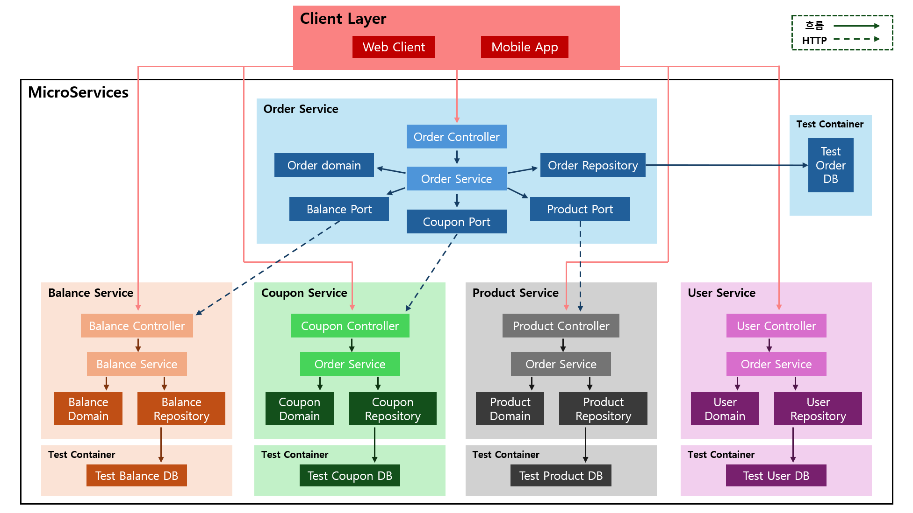
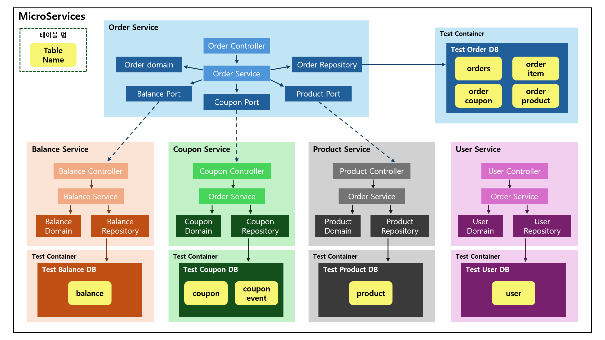

## 데이터베이스 및 테이블

### 목차

#### 1. 전체 구조
#### 2. 테이블 구조

 

---

 

### 1. 전체 구조

#### 서비스별 테스트 컨테이너 & DB

#### DB별 Table

 

---

 

### 2. 테이블 구조

#### Balance Service
##### balance
| 컬럼명     | 타입    | 제약조건  | 설명    |
|---------|--------|----------|--------|
| user_id | BIGINT    | PK, NOT NULL  | 사용자 ID    |
| amount  | DECIMAL(19,2)   | NOT NULL  | 잔액    |

 

#### Coupon Service
##### coupon
| 컬럼명     | 타입    | 제약조건  | 설명    |
|---------|--------|----------|--------|
| code | VARCHAR(50) | PK, NOT NULL | 쿠폰 코드 |
| user_id | BIGINT | NOT NULL | 사용자 ID |
| coupon_event_id | BIGINT | NOT NULL | 쿠폰 이벤트 ID |
| discount_amount | DECIMAL(19,2) | NOT NULL | 할인 금액 |
| issued_at | DATETIME | NOT NULL | 발급 시간 |
| expires_at | DATETIME | NOT NULL | 만료 시간 |
| used | BOOLEAN | NOT NULL | 사용 여부 |

##### coupon_event
| 컬럼명     | 타입    | 제약조건  | 설명    |
|---------|--------|----------|--------|
| id | BIGINT | PK, NOT NULL | 이벤트 ID |
| name | VARCHAR(50) | NOT NULL | 이벤트명 |
| discount_amount | DECIMAL(19,2) | NOT NULL | 할인 금액 |
| total_quantity | INT | NOT NULL | 총 수량 |
| remaining_quantity | INT | NOT NULL | 남은 수량 |
| expires_at | DATETIME | NOT NULL | 만료 시간 |
| version | BIGINT | NOT NULL | 버전 |

 

#### Order Service
##### orders
| 컬럼명     | 타입    | 제약조건  | 설명    |
|---------|--------|----------|--------|
| id | BIGINT | PK, NOT NULL | 주문 ID |
| user_id | BIGINT | NOT NULL | 사용자 ID |
| total_price | DECIMAL(19,2) | NOT NULL | 총 가격 |
| status | VARCHAR(20) | NOT NULL | 주문 상태 |
| created_at | DATETIME | NOT NULL | 생성 시간 |

##### order_item
| 컬럼명     | 타입    | 제약조건  | 설명    |
|---------|--------|----------|--------|
| id | BIGINT | PK, NOT NULL | 주문 항목 ID |
| order_id | BIGINT | NOT NULL | 주문 ID |
| order_product_id | BIGINT | NOT NULL | 주문 상품 ID |
| quantity | INT | NOT NULL | 수량 |
| unit_price | DECIMAL(19,2) | NOT NULL | 단가 |

##### order_coupon
| 컬럼명     | 타입    | 제약조건  | 설명    |
|---------|--------|----------|--------|
| id | BIGINT | PK, NOT NULL | 주문 쿠폰 ID |
| order_id | BIGINT | NOT NULL | 주문 ID |
| coupon_code | VARCHAR(50) | NOT NULL | 쿠폰 코드 |
| discount_amount | DECIMAL(19,2) | NOT NULL | 할인 금액 |
| used | BOOLEAN | NOT NULL | 사용 여부 |

##### order_product
| 컬럼명     | 타입    | 제약조건  | 설명    |
|---------|--------|----------|--------|
| id | BIGINT | PK, NOT NULL | 주문 상품 ID |
| product_id | BIGINT | NOT NULL | 상품 ID |
| name | VARCHAR(50) | NOT NULL | 상품명 |
| price | DECIMAL(19,2) | NOT NULL | 가격 |

 

#### Product Service
##### product
| 컬럼명     | 타입    | 제약조건  | 설명    |
|---------|--------|----------|--------|
| id | BIGINT | PK, NOT NULL | 상품 ID |
| name | VARCHAR(50) | NOT NULL | 상품명 |
| price | DECIMAL(19,2) | NOT NULL | 가격 |
| stock | INT | NOT NULL | 재고 |
| reserved_stock | INT | NOT NULL | 예약 재고 |
| version | BIGINT | NOT NULL | 버전 |

 

#### User Service
##### user
| 컬럼명     | 타입    | 제약조건  | 설명    |
|---------|--------|----------|--------|
| id | BIGINT | PK, NOT NULL | 사용자 ID |

