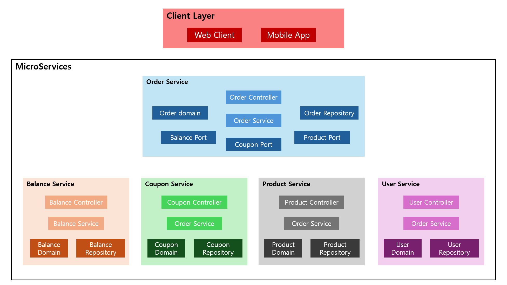
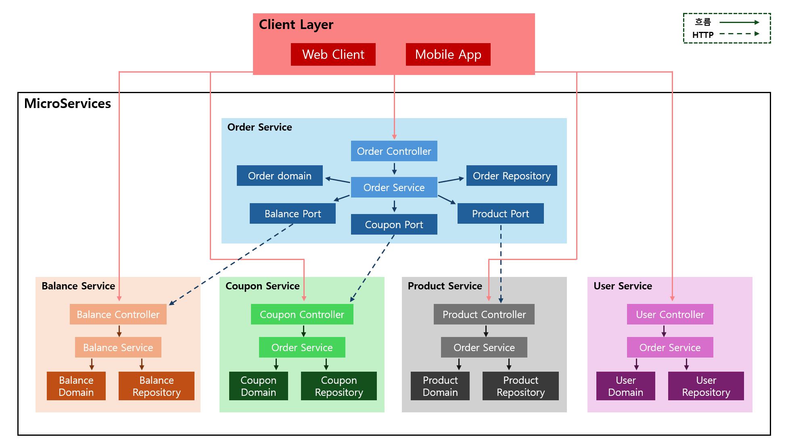
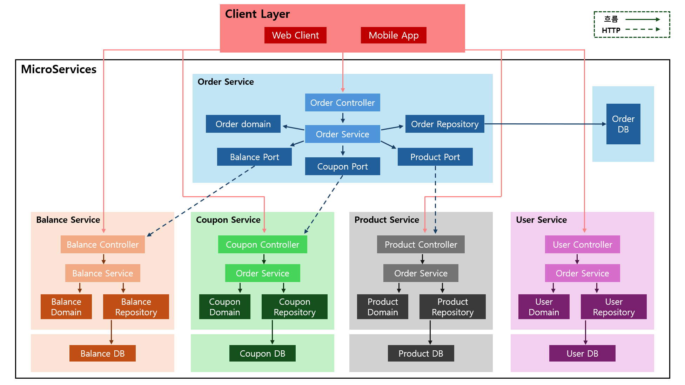

## 아키텍처 구조

### 목차

#### 1. 전체 구조
#### 2. 서비스별 상세 구조

<br>

---

<br>

### 1. 전체 구조

#### 각 서비스별 구성 요소


#### 흐름도


#### 전체 흐름도


#### Test 환경 연결 흐름도


<br>

---

<br>

### 2. 서비스별 상세 구조

#### Balance Service

- 사용자 잔액 충전, 차감, 조회
```
balance-service
├── adapter
│   ├── in
│   │   └── web
│   │       └── BalanceController
│   └── out
│       └── persistence
│           └── BalanceRepositoryAdapter
├── application
│   ├── port
│   │   ├── in
│   │   │   └── BalanceUseCase
│   │   └── out
│   │       └── BalanceRepository
│   └── service
│       └── BalanceService
└── domain
    └── Balance
```

#### Product Service

- 상품 조회, 재고 관리, 인기상품 조회
```
product-service
├── adapter
│   ├── in
│   │   └── web
│   │       └── ProductController
│   └── out
│       └── persistence
│           └── ProductRepositoryAdapter
├── application
│   ├── port
│   │   ├── in
│   │   │   └── ProductUseCase
│   │   └── out
│   │       └── ProductRepository
│   └── service
│       └── ProductService
└── domain
    └── Product
```

#### Coupon Service

- 쿠폰 발급, 검증, 할인금액 조회
```
coupon-service
├── adapter
│   ├── in
│   │   └── web
│   │       └── CouponController
│   └── out
│       └── persistence
│           └── CouponRepositoryAdapter
├── application
│   ├── port
│   │   ├── in
│   │   │   └── CouponUseCase
│   │   └── out
│   │       └── CouponRepository
│   └── service
│       └── CouponService
└── domain
    ├── Coupon
    └── CouponEvent
```

#### Order Service

- 주문 생성, 결제 처리, 외부 서비스 조율
```
order-service
├── adapter
│   ├── in
│   │   └── web
│   │       └── OrderController
│   ├── out
│   │   ├── external
│   │   │   ├── BalanceClientAdapter
│   │   │   ├── CouponClientAdapter
│   │   │   └── ProductClientAdapter
│   │   └── persistence
│   │       └── OrderRepositoryAdapter
├── application
│   ├── port
│   │   ├── in
│   │   │   └── OrderUseCase
│   │   └── out
│   │       ├── OrderRepository
│   │       ├── BalancePort
│   │       ├── CouponPort
│   │       └── ProductPort
│   └── service
│       └── OrderService
└── domain
    ├── Order
    ├── OrderItem
    ├── OrderCoupon
    └── OrderProduct
```

#### User Service

- 사용자 정보 관리
```
user-service
├── adapter
│   ├── in
│   │   └── web
│   │       └── UserController
│   └── out
│       └── persistence
│           └── UserRepositoryAdapter
├── application
│   ├── port
│   │   ├── in
│   │   │   └── UserUseCase
│   │   └── out
│   │       └── UserRepository
│   └── service
│       └── UserService
└── domain
    └── User
```
