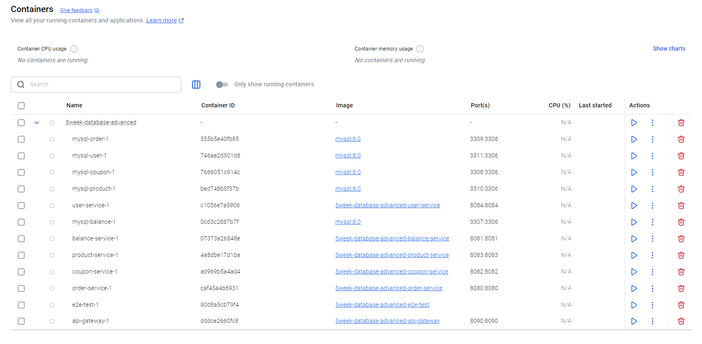

## 1. E-Commerce 서비스 E2E 테스트 방법

### 2. 실행 환경

- 컴퓨터 환경
    - Windows 11
    - 프로세서 AMD Ryzen 5 5600X 6-Core Processor
    - 설치된 RAM	32.0GB(31.9GB 사용 가능)
    - 시스템 종류	64비트 운영 체제, x64 기반 프로세서

- 사용 도구
    - IntelliJ Ultimate
    - Docker Desktop


### 3. 사용 명령어 및 진행과정

#### 3.1. 사용 명령어 - IntelliJ Terminal
```
# 실행 위치 : 5 Week - database-advanced

./gradlew :balance-service:bootJar
./gradlew :coupon-service:bootJar
./gradlew :order-service:bootJar
./gradlew :product-service:bootJar
./gradlew :user-service:bootJar
./gradlew :api-gateway:bootJar

docker-compose up --build
```

#### 3.2. 실행 과정

- 컨테이너 생성



- DataBase 관련 컨테이너 실행


- 서비스 컨테이너 실행


- health체크 후 order-service 실행

(만약 order-service가 실행되지 않는다면 처음부터 다시)


- api-gateway 컨테이너 실행


- e2e 테스트 컨테이너 실행


- 테스트 종료 후 Control + c 키를 이용하여 컨테이너 종료


- 상단에 위치한 삭제 버튼 클릭(초록색 박스)


- 삭제버튼 클릭


#### 4. e2e-tests/results 폴더에서 결과 확인

- 상세한 결과는 터미널에서 로그로 확인


