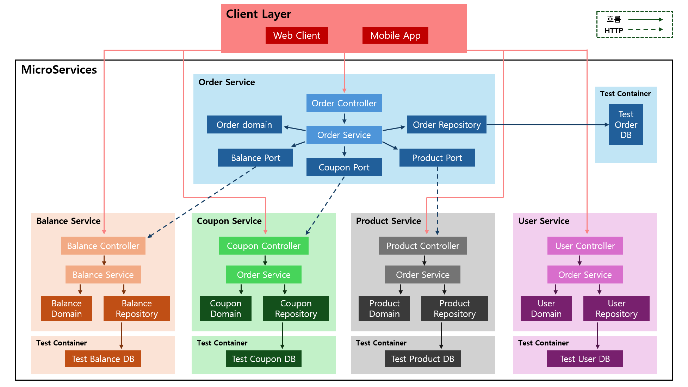
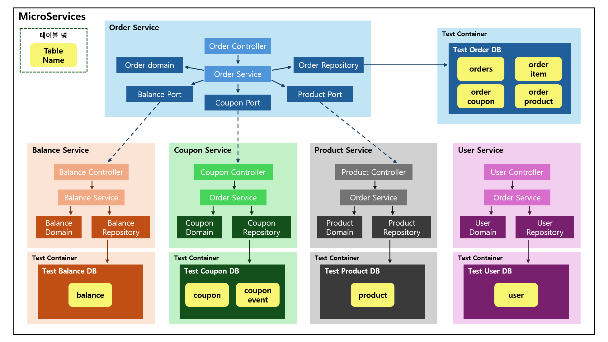

# 1. 동시성 문제에 관한 보고서

 

## 2. 목차

- 전체 서비스 구성
- Product Service 
- Balance Service
- Coupon Service
- Order Service

 

## 3. 전체 서비스 구성 

- 4주차 구성내용(1)

- 4주차 구성내용(2)

- 5주차 변경내용
  - Order Service -> Saga 패턴 적용
  - Product Service -> CQRS 적용
  - 4주차 피드백 반영(feign, api-gateway)

 

## 4. Product Service

- 발생 가능 문제(Command)
  - 재고를 확인하고 차감하는 사이 동시성관련 문제 발생 가능

- 해결방법 : 비관적 Lock 
  - 재고는 정확해야하며 음수가 불가능해야한다
  - 동시 주문이 많기때문에 충돌이 자주 발생하게 된다
  - 재시도하게 될 경우 트래픽 문제가 더 심해지므로 대기하도록 한다

---

- 발생 가능 문제(Query)
  - 읽기 전용이므로 Lock과 관련된 문제가 없음

---

- 발생 가능 문제(Event)
  - 순서와 관련된 문제 발생 가능

- 해결방법 : 낙관적 Lock
  - 순서 보장을 위한 Version 관리 필요

 

## 5. Balance Service

- 발생 가능 문제
  - A사용자가 충전중인 잔액을 B사용자가 조회하여 잘못된 정보 확인
  - 잔액 확인 & 차감 과정에서 잔액 초과 사용 가능성 존재

- 해결방법 : 비관적 Lock
  - 금전 거래의 경우 무결성이 필수
  - 잔액 부족으로 인한 실패가 발생할 수 있고 자주 발생할 수 있음

 

## 6. Coupon Service

- 발생 가능 문제
  - 발급 중인 쿠폰의 남은 수량을 잘못읽어 초과 발급 가능성

- 해결방법 : 낙관적 Lock
  - 쿠폰 발급의 경우 충돌 빈도가 상대적으로 낮음(초기 발급상황 제외..)
  - 실패 시 재시도 가능

 

## 7. Order Service

- 발생 가능 문제
  - 주문 생성 중 재고 확인, 차감등 진행과정에서 다른 트랜잭션의 영향으로 인한 음수 재고 발생 가능

- 해결방법 : 낙관적 Lock
  - SAGA 패턴임으로 상태 변경 보호(Version)

